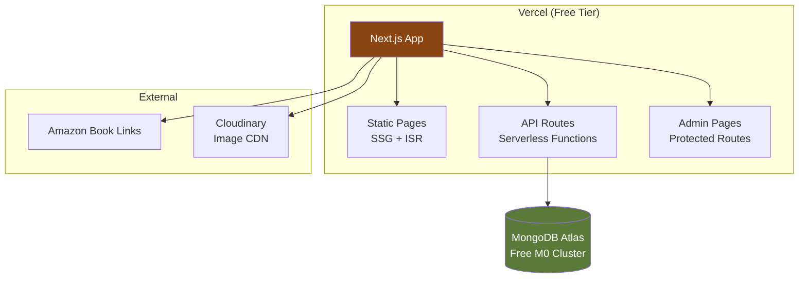

# Writer/Poet Portfolio Website — Implementation Plan

A professional, production-ready portfolio website for a Hindi/English writer and poet. The site will showcase poetry, stories, published books (with Amazon links), awards, and serve as a professional portfolio for literary agents and auditors.

---

## Answers to Your Questions

### 1. Should we keep a comment section?

> [!TIP]
> **Recommendation: Skip comments for now, add later if needed.**

Here's why:
- **Spam risk** — Comment sections attract spam bots; moderation is needed
- **Auth complexity** — Requiring signup for comments adds friction and complexity (user management, email verification, password resets)
- **Cost** — More DB reads/writes eat into free tier limits
- **Alternative** — Add a simple "Share your thoughts" link to her email/social media. This keeps it personal and authentic, which suits a literary brand
- **Future option** — We can add Disqus or Giscus (GitHub-based) comments later with minimal effort if the audience grows

### 2. What should be the color palette?

> [!IMPORTANT]
> A literary portfolio should feel **warm, elegant, and timeless** — not loud or corporate.

**Recommended Palette: "Ink & Parchment"**

| Role | Light Mode | Dark Mode | Usage |
|------|-----------|-----------|-------|
| **Background** | `#FEFCF8` (warm cream) | `#1A1814` (deep charcoal) | Page background |
| **Surface** | `#F5F0E8` (parchment) | `#252219` (warm dark) | Cards, sections |
| **Primary** | `#8B4513` (saddle brown) | `#D4A574` (warm gold) | Headings, accents, links |
| **Secondary** | `#6B5B4F` (warm gray-brown) | `#A89585` (muted gold) | Subtext, borders |
| **Accent** | `#C4956A` (amber) | `#E8C49A` (light amber) | Buttons, highlights, tags |
| **Text Primary** | `#2C1810` (near-black brown) | `#EDE6DB` (warm white) | Body text |
| **Text Secondary** | `#6B5B4F` (warm gray) | `#A89585` (muted) | Captions, metadata |
| **Success** | `#5B7A3A` (olive green) | `#8FBC5B` | Success states |
| **Border** | `#E0D4C4` (light tan) | `#3D362E` (dark tan) | Separators |

This gives a **book-like, literary feel** — like reading on quality paper. The warm tones complement Hindi calligraphy beautifully and feel premium without being flashy.

### 3. What should I use for UI/UX? MUI, Tailwind, shadcn?

> [!IMPORTANT]
> **Recommendation: Tailwind CSS + shadcn/ui**

| Framework | Pros | Cons | Verdict |
|-----------|------|------|---------|
| **MUI** | Full component library, Material Design | Heavy bundle, opinionated styling, hard to customize deeply | ❌ Too corporate-looking for a literary site |
| **Tailwind only** | Lightweight, full control | Need to build every component from scratch | ⚠️ More work |
| **shadcn/ui + Tailwind** | Beautiful defaults, fully customizable, copy-paste (not dependency), lightweight | Slight learning curve | ✅ **Best choice** |

**Why shadcn/ui wins:**
- Components are **copied into your project** (not a dependency) — full control
- Built on **Radix UI** primitives — accessible by default
- **Easily themed** — perfect for our custom "Ink & Parchment" palette
- **Tree-shakeable** — only ship what you use
- Works perfectly with Next.js + Tailwind

---

## Tech Stack

| Layer | Technology | Why |
|-------|-----------|-----|
| **Framework** | Next.js 14 (App Router) | SSR/SSG, API routes, Vercel-native, great SEO |
| **Language** | TypeScript | Type safety, better DX |
| **Styling** | Tailwind CSS + shadcn/ui | Customizable, lightweight, accessible |
| **Database** | MongoDB Atlas (Free M0 tier) | 512MB free, generous for this use case |
| **ORM** | Mongoose | Schema validation, easy queries |
| **Auth** | NextAuth.js | Simple admin-only auth, no user management needed |
| **Rich Text Editor** | Tiptap | Markdown + WYSIWYG, extensible, Hindi support |
| **Deployment** | Vercel (Free Hobby plan) | Zero-config Next.js deployment, serverless functions |
| **Fonts** | Inter + Noto Sans Devanagari | Clean English + native Hindi rendering |
| **Image Storage** | Vercel Blob or Cloudinary (free) | For book covers, profile photos |

> [!NOTE]
> **Why no separate backend?** Next.js API Routes act as serverless functions on Vercel. MongoDB Atlas free tier gives 512MB storage — more than enough for a literary portfolio. This keeps everything in one repo, one deployment, zero additional cost.

---

## Architecture



---

## Project Structure

```
manisha/
├── app/
│   ├── layout.tsx              # Root layout (fonts, theme, navbar, footer)
│   ├── page.tsx                # Homepage
│   ├── globals.css             # Global styles + design tokens
│   ├── works/
│   │   ├── page.tsx            # Works listing (filterable grid)
│   │   └── [slug]/page.tsx     # Individual work detail page
│   ├── books/
│   │   └── page.tsx            # Published books showcase
│   ├── about/
│   │   └── page.tsx            # About/Profile + Awards
│   ├── admin/
│   │   ├── login/page.tsx      # Admin login
│   │   ├── dashboard/page.tsx  # Admin dashboard
│   │   └── create/page.tsx     # Create/Edit post
│   └── api/
│       ├── auth/[...nextauth]/route.ts
│       ├── works/route.ts      # CRUD for works
│       ├── books/route.ts      # CRUD for books
│       └── awards/route.ts     # CRUD for awards
├── components/
│   ├── ui/                     # shadcn components
│   ├── layout/                 # Navbar, Footer, ThemeToggle
│   ├── home/                   # Hero, FeaturedWorks, BookShowcase
│   ├── works/                  # WorkCard, WorkGrid, FilterBar
│   ├── books/                  # BookCard, BookGrid
│   └── admin/                  # Editor, PostForm, AdminSidebar
├── lib/
│   ├── db.ts                   # MongoDB connection
│   ├── models/                 # Mongoose schemas
│   ├── auth.ts                 # NextAuth config
│   └── utils.ts                # Helpers
├── types/
│   └── index.ts                # TypeScript interfaces
└── public/
    └── images/                 # Static assets
```

---

## Proposed Changes — Page by Page

### Homepage

The landing page that sets the literary tone and hooks visitors.

**Sections:**
1. **Hero** — Large, elegant hero with her name, tagline ("Poet. Storyteller. Author."), and subtle animated ink/quill element
2. **Featured Works** — 3-4 highlighted poems/stories in a card carousel
3. **Published Books** — Horizontal scroll of book covers with "Buy on Amazon" CTAs
4. **Awards & Recognition** — Clean grid of awards with year and description
5. **About Teaser** — Short bio with "Read More" linking to About page

---

### Works Page

Browsable collection of all published poems, stories, and other writing.

**Features:**
- **Search bar** — Full-text search across title, content, tags
- **Tag filter chips** — Poetry, Story, Essay, Hindi, English, etc.
- **Category tabs** — All | Poems | Stories | Essays
- **Sortable** — Newest first, oldest first, most popular
- **Card grid** — Each card shows title, excerpt (first 2 lines), tags, date, language badge (हिंदी / English)
- **Pagination** or infinite scroll

---

### Individual Work Page (`/works/[slug]`)

Full reading experience for a single piece.

**Features:**
- Clean, distraction-free reading layout
- **Language-aware typography** — Larger font for Hindi (Noto Sans Devanagari), proper line-height
- Title, author attribution, date, tags
- Content with proper formatting (stanzas for poetry, paragraphs for prose)
- "Share" buttons (copy link, Twitter/X, WhatsApp)
- "Next/Previous" navigation to adjacent works

---

### Books Page

Showcase of published books with direct purchase links.

**Features:**
- Large book cover images
- Book title, description, publication year
- **"Buy on Amazon" button** — Direct link to Amazon listing
- Genre/category tags
- Optional: Reviews/testimonials section

---

### About/Profile Page

Professional bio and credentials.

**Sections:**
1. **Profile photo** + name + title
2. **Bio** — Detailed professional bio (supports Hindi + English)
3. **Awards & Achievements** — Timeline or grid layout with award name, year, issuing body, description
4. **Writing Journey** — Brief narrative
5. **Contact** — Email, social media links
6. **Resume/CV download** — Optional PDF download for literary agents

---

### Admin Section (Protected — Author Only)

Simple CMS for the author to manage content.

**Pages:**
- **Login** — Email/password (single admin user via NextAuth Credentials provider)
- **Dashboard** — Overview of all works, books, awards with edit/delete actions
- **Create/Edit Work** — Rich text editor (Tiptap) with:
  - Title field
  - Category selector (poem/story/essay)
  - Tag input
  - Language toggle (Hindi/English/Bilingual)
  - Content editor with formatting toolbar
  - Preview mode
  - Publish/Draft toggle
- **Manage Books** — Add/edit book entries (title, cover image URL, Amazon link, description)
- **Manage Awards** — Add/edit awards

---

## Key Technical Details

### Hindi Language Support
- **Font**: Noto Sans Devanagari from Google Fonts — best free Devanagari font
- **CSS**: Conditional `font-family` and `line-height` based on content language
- **Direction**: Hindi is LTR (no RTL needed), but needs ~20% larger `line-height` for readability
- **Input**: The Tiptap editor natively supports Hindi input via OS keyboard
- **Display**: Language badge on each work card (🇮🇳 हिंदी / 🇬🇧 English)

### Dark Mode
- Toggle in navbar header
- Persisted in `localStorage`
- Uses CSS custom properties for instant switching
- shadcn/ui has built-in dark mode support via `next-themes`

### SEO
- Dynamic `<title>` and `<meta>` tags per page
- Open Graph tags for social media sharing
- Structured data (JSON-LD) for author and book schema
- Sitemap generation
- Clean URLs via Next.js routing

### MongoDB Schemas

```typescript
// Work (poem/story/essay)
{
  title: string
  slug: string          // URL-friendly, auto-generated
  content: string       // Rich text / Markdown
  excerpt: string       // First 150 chars for cards
  category: 'poem' | 'story' | 'essay' | 'other'
  tags: string[]
  language: 'hindi' | 'english' | 'bilingual'
  status: 'draft' | 'published'
  featuredImage?: string
  createdAt: Date
  updatedAt: Date
}

// Book
{
  title: string
  slug: string
  description: string
  coverImage: string
  amazonLink: string
  genre: string
  publicationYear: number
  featured: boolean
  createdAt: Date
}

// Award
{
  title: string
  issuingBody: string
  year: number
  description: string
  image?: string
  createdAt: Date
}
```

---

## Suggested Additional Pages

| Page | Reason |
|------|--------|
| **/books** | Separate dedicated page for book listings (not just homepage section) |
| **/contact** | Simple contact form or info page for literary agents |
| **404 page** | Custom, on-brand "Page Not Found" design |

---

## Verification Plan

### Automated / Semi-Automated Tests
1. **Build check**: `npm run build` must pass with zero errors
2. **Lint check**: `npm run lint` must pass
3. **Type check**: `npx tsc --noEmit` must pass
4. **Browser validation**: Use browser tool to verify:
   - Homepage loads with all sections visible
   - Works page renders cards, search, and filters work
   - Dark mode toggles correctly
   - Hindi content renders with proper fonts
   - Book cards show Amazon links
   - Admin login flow works
   - Create/edit post form functions correctly
   - Responsive layout on mobile viewport

### Manual Verification (by you, the user)
1. **Visual review** — Open the dev server (`npm run dev`) and check each page visually
2. **Hindi rendering** — Verify Hindi text looks crisp and readable on the Works and detail pages
3. **Dark mode** — Toggle dark mode and check all pages for contrast/readability
4. **Admin flow** — Log in as admin, create a test post, verify it appears on the works page
5. **Mobile** — Resize browser / use phone to check responsive layout
6. **Amazon links** — Verify book links open correctly
7. **Deploy preview** — Push to GitHub, check Vercel preview deployment

---

## Free Tier Limits & What Fits

| Service | Free Limit | Our Usage | Fits? |
|---------|-----------|-----------|-------|
| **Vercel Hobby** | 100GB bandwidth, serverless functions | Low-traffic portfolio | ✅ |
| **MongoDB Atlas M0** | 512MB storage, shared cluster | Text content + metadata (~50MB max) | ✅ |
| **Cloudinary Free** | 25GB storage, 25GB bandwidth | ~50 book covers + profile photos | ✅ |
| **NextAuth** | Open source | Single admin user | ✅ |

> [!NOTE]
> This entire stack runs at **$0/month** for a low-traffic portfolio. The only cost would come if traffic exceeds Vercel's 100GB bandwidth limit (very unlikely for a literary portfolio).
